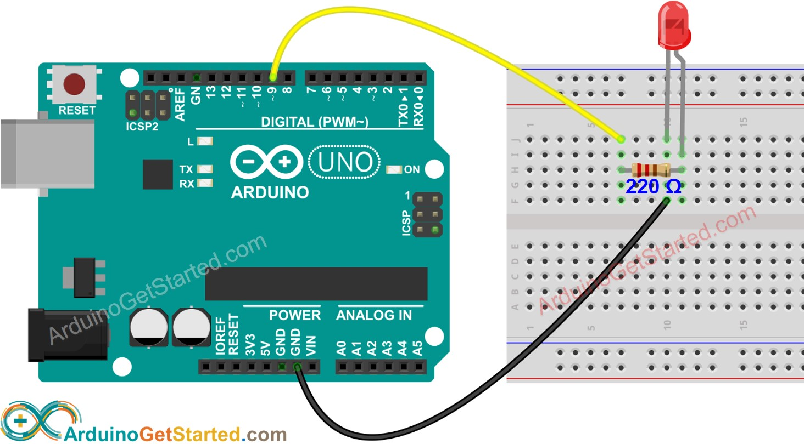
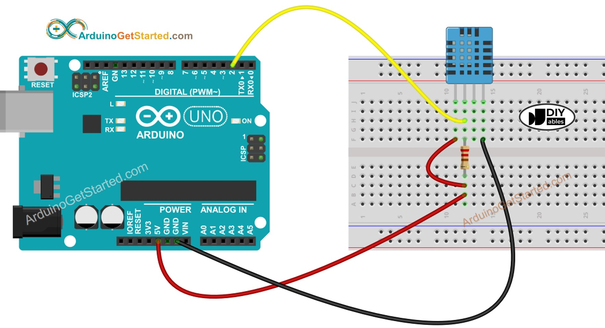

## Working Principle

DHT11 sensor consists of a capacitive humidity sensing element and a thermistor for sensing temperature.
The humidity sensing capacitor has two electrodes with a moisture holding substrate as a dielectric between them.
Change in the capacitance value occurs with the change in humidity levels. The IC measure, process this changed
resistance values and change them into digital form.

For measuring temperature this sensor uses a Negative Temperature coefficient thermistor, which causes a decrease
in its resistance value with increase in temperature. To get larger resistance value even for the smallest change
in temperature, this sensor is usually made up of semiconductor ceramics or polymers.

### LED circuit

### DHT11 circuit

Sources
--------
- https://arduinogetstarted.com/tutorials/arduino-dht11
- https://arduinogetstarted.com/tutorials/arduino-led-blink
- https://www.elprocus.com/a-brief-on-dht11-sensor/